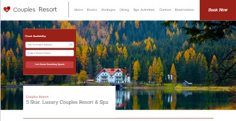
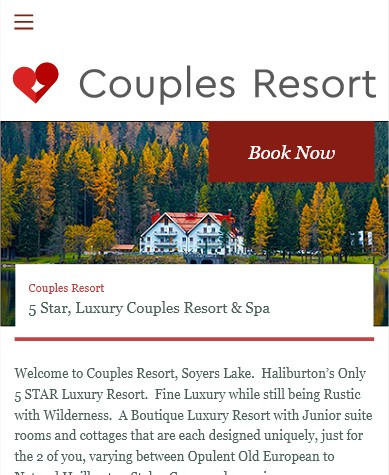
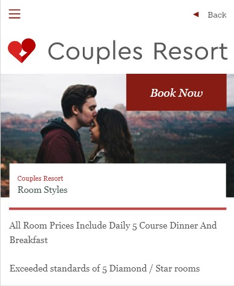
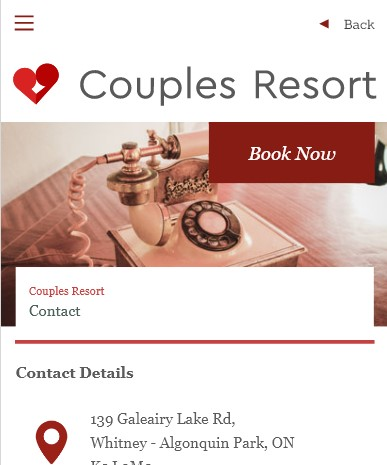

# Nathalia Lima - FIP
This repo is for FIP - Final Integrated Project - Level 1

___

## To Do List - by Nathalia Lima

This project was created and designed during the first level of the IDP course.

Here you will find the Couples Resort website with a new design, based on the lessons and pre-definitions covered in the classroom, as the scope of the project.
___

There is still a lot of work to be done, we are in the first delivery.

Check back soon to see the new features on our website.

___

These are some of the scope pages:

- Home page

- Dining page

- Rooms page

- And Contact page, which is under construction

___

## Installation

There is no installation required.

## Usage

Open index.html in the browser of your choice.

## Contributing

1. Fork it!
2. Create your feature branch: `git checkout -b my-new-feature`
3. Commit your changesL `git commit -am 'Add some feature'`
4. Push to the branch: `git push origin my-new-feature`
5. Submit a pull request :D

## History

December 12st, 2023

## Credits

Nathalia Lima

## License

MIT - please see [license file](LICENSE).